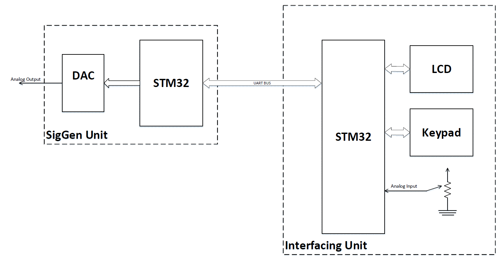

# Microprocessor 

Some of my microprocessor assignments for microprocessor course at Shahid Beheshti University

---
## HW2

In this assignment, a number of simple functions are implemented by the 8086 assembly language.
In all the following programs, the input is received in decimal and the output is displayed in decimal form.
The explanation of each of these functions is as follows: 

1) Find the GCD of two numbers
2) Find the factorial of a number
3) Check if the input number (binary) is Palindrome or not
4) Read a string and convert all lower-case to upper-case characters and vice versa
5) Calculate the square root of the perfect square number
6) Insertion Sort
7) Recursive fibonacci function

---
## HW3

In this assignment, a simple single player pong game implemented for 8086 assembly language.

---
## HW4

In this assignment, a counter with start/stop and up/down button was provided which connected to a 8086
microprocessor and react to user inputs.

---
## Project

### Description 

The purpose of this project is to implement Signal Generator using STM32F401 microcontroller.

The system consists of two modules. One module is responsible for communicating with the user and the other module is responsible for generating waveforms. 

A STM32F401 microcontroller is used for each module. These two parts are connected to each other using USART. Below image shows the block diagram of this system. In this tool, it is possible to create sin, square, triangular, absolute sin, step and sawtooth waveforms. The user can specify the output frequency, and the duration of the signal on the output.

### How it works
A variable resistor, a keypad and a display are used to communicate with the user.

After the system is turned on, a number is first displayed on the screen for 1 second, then the user is shown possible options for waveforms (waveform name and corresponding code).

After capturing the type of wave to be drawn, through a variable resistor (analog to digital conversion), the duration of the waveform application is received from the application. During the change of resistance, its value is displayed on the screen and at the end we go to the next step with the # button.

Then the frequency value is received from the user in the next step and by pressing # the information is sent to be drawn to another system.

This information is displayed on the screen by another system. The user has to wait until the end of drawing his waveform to be able to apply the next input.

## Note

All projects are done using Proteus Pro 8.10 SP3 and Keil MDK-ARM 5.30